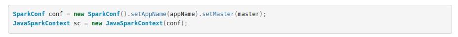
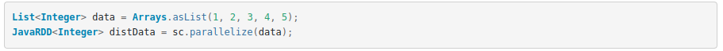
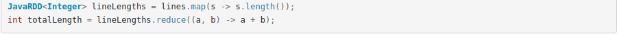
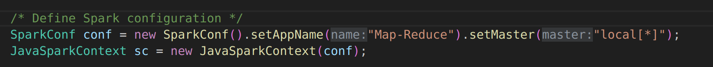
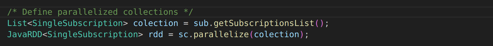
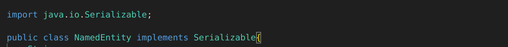
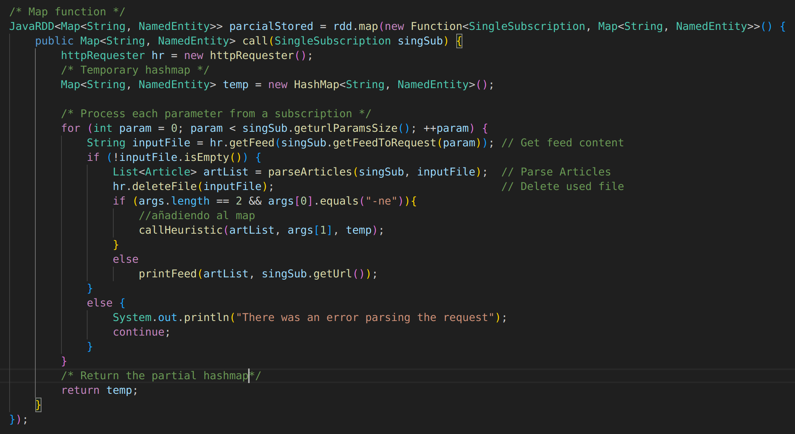
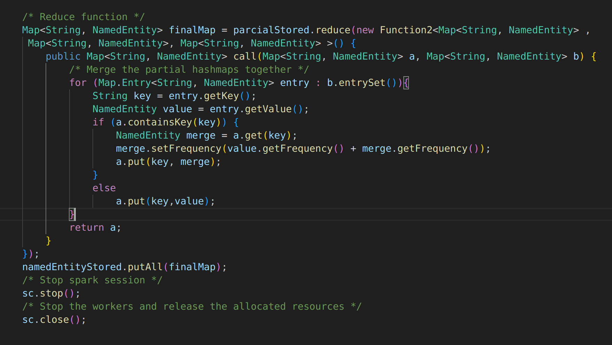

## Laboratorio 3: Calculo distribuido
###### Paradigmas: famaf 2023
###### Tomas Marmay

### Introduccion 
En este laboratorio se va a reutilizar el codigo del laboratorio 2, para leer feeds, clasificar entidades nombras y contar sus apariciones, e integrarlo con **Spark** para hacer *calculo distribuido*, es decir que multiples maquinas trabajen en conjunto para resolver un problema en comun.
Estos son algunos de los conceptos que consideramos importantes a tener en cuenta antes de trabajar con **Spark**, que fueron extraidos de algún proyecto de ejemplo en github, alguna notebook de colab, kaggle o alguna referencia del mismo proyecto Spark.
  - Que es `RDD` ? 
      - The main abstraction Spark provides is a resilient distributed dataset (RDD), which is a collection of elements partitioned across the nodes of the cluster that can be operated on in parallel. RDDs are created by starting with a file in the Hadoop file system (or any other Hadoop-supported file system), or an existing Scala collection in the driver program, and transforming it ~   [spark.apache.org](https://spark.apache.org/docs/latest/rdd-programming-guide.html#overview).
    - Que es un `Cluster` ? 
      - A Spark cluster is a combination of a Driver Program, Cluster Manager, and Worker Nodes that work together to complete tasks ~ [educative.io](https://www.educative.io/answers/how-to-launch-a-cluster-in-spark-3).

Basicamente lo que vamos a hacer es lo siguente:
  - RDDs support two types of operations: transformations, which create a new dataset from an existing one, and actions, which return a value to the driver program after running a computation on the dataset. For example, map is a transformation that passes each dataset element through a function and returns a new RDD representing the results. On the other hand, reduce is an action that aggregates all the elements of the RDD using some function and returns the final result to the driver program ~[spark.apache](https://spark.apache.org/docs/latest/rdd-programming-guide.html#overview).
  
Se puede consultar [consignas](https://docs.google.com/document/d/1xzMfqcwtMjRhvrdLHI_g-dNWz62ra-6Vp87sf2woLhg/edit?usp=sharing) para mas detalles.
### Respuestas

- ##### Pasos para instalar Spark 
    - Para instalar Spark en una computadora personal basta con seguir [guia de instalacion](https://cloudinfrastructureservices.co.uk/how-to-install-apache-spark-on-ubuntu-20-04/). 

- ##### Estructura de un programa en Spark
    - Un programa en Spark bajo la filosofia de map-reduce consta de 3 partes:
        1. Crear un contexto de Spark 
          
        1. Definir que estructura de datos se va a parelelizar 
           
        1. Definir las funciones map y reduce 
          

- ##### Estructura de programa de conteo de palabras
    - Primero se debe crear un contexto, seguido de un arreglo donde esten los documentos a parelalizar. Por ultimo una funcion map tal que sea capaz de a partir de un documneto contar la cantidad de palabras y devolver ese numero. Y una funcion reduce que vaya haciendo las sumas parciales de dos documentos distintos hasta quedarse con el numero final de palabras.

- ##### Como adaptar el laboratorio 2 para usarlo con Spark
    - Para poder adaptar el laboratorio 2 para usarlo con spark no es necesario hacer grandes cambios, basta con poder entender como traducir un programa secuencial a uno que se pueda paralelizar.
        1. Definimos el contexto 
        1. Hacemos una lista de las singlesubcriptions extraidas del archivo *subscriptions.json* y la definimos como paralelizable.
        1. Para que Spark funcione correctamente, se debe modificar la clase **NamedEntity** de tal forma que las instancias de la misma sean serializables(que se puedan convertir objetos en una secuencia de bytes). 
        De forma similar se hizo para todas las las clases de myClasses.
        1. Transformamos el codigo de tal manera que el procesamiento de las singlesubcriptions sea la funcion map. Por lo tanto va a haber un Hashmap por cada singlesubcription, lo que nos va a permitir que el procesamiento de cada una de ellas sea independiente.
        1. Escribimos una funcion reduce que se encargue de hacer los merge entre los distintos Hashmap que se crearon en la funcion map.

- ##### Como integral OOP con la estructura funcional de map-reduce
    - Lo que nos brinda la programacion orientada a objetos integrada con la estructura map-reduce,son las ventajas de ambos paradigmas para abordar problemas complejos y lograr un procesamiento eficiente.
    Cuando se abordan problemas desde una perspectiva concurrente se busca aprovechar la paralelización pero es importante tener en cuenta que no todos los problemas son adecuados para ser resueltos de manera paralela. La paralelización efectiva requiere un análisis cuidadoso y una comprensión profunda del problema y de las dependencias entre las tareas. Por lo que se debe tener cuidado cuando trabajamos con objetos para determinar como van a ser las funciones map-reduce.

##### Compilacion
  - `configurar el entorno`: export CLASSPATH=../utils/json-simple-1.1.1.jar:../utils/json-20230227.jar:.:/mnt/spark/jars/*
  - `compilar`: javac FeedReaderMain.java
  - `correr ejecutable`:
    - java FeedReaderMain
    - java FeedReaderMain -ne (Quick/Random)
 
##### Configuraciones de Spark
  - `local[*]` 	Run Spark locally with as many worker threads as logical cores on your machine ~ [master urls](https://spark.apache.org/docs/latest/submitting-applications.html).

##### Borrar archivos .class de manera rapida 
  - `find src/ -type f -name "*.class" -exec rm {} + `
